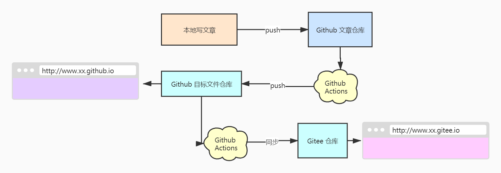

# 如何打造一个静态博客


本篇文章主要是介绍如何搭建一个免费的个人或团队博客:tada:。

### 起因

团队长期在内部系统中写技术文章，只能内部访问，辐射范围太小，写作和阅读体验差。

### 好处

- 提升团队在业界的品牌和影响力
- 有利于吸引求职者

### 目标

我们要实现的最终效果是：

- *不花一分钱*
- 外网可**快速**访问
- 更好的写作体验
- 自动化部署

## 写作

::: tip
好的写作体验是什么？Vscode之类的本地编辑器肯定是首选的工具，纯粹的写作就应该是纯文本的，因此Markdown也自然成了最佳的格式。
:::

### CMS选择

选择 `vuepress` 的原因是因为它

- 基于我们熟悉的Vue
- 可插入Vue组件
- 支持本地 Markdown 纯写作
- 支持本地预览和热加载
- 支持丰富的插件和定制

当然也有其它类似的，可以查看[官网的对比](https://vuepress.vuejs.org/zh/guide/#%E4%B8%BA%E4%BB%80%E4%B9%88%E4%B8%8D%E6%98%AF)

### Markdown

VuePress 使用 [markdown-it](https://markdown-it.github.io/) 来渲染 Markdown

- [Vuepress Markdown扩展](https://vuepress.vuejs.org/zh/guide/markdown.html)

## 部署

完成写作之后，可以执行 `npm run build` 来将其构建成可以在浏览器中运行的目标文件。

### 服务空间选择

生成的 `dist` 目录需要部署到服务器上面绑上域名才可以在外网浏览，所以我们需要选择一个服务器，那么通常的服务器是需要收费的。

但穷，穷则生变，会引发我们思考，有没有免费的服务器可以用来部署呢？当然有，Github本身就提供了静态页面托管的功能[GitHub Pages](https://pages.github.com/)，我们只需要把生成的 `dist` push 到指定的仓库即可在线上浏览，详细步骤就不说了。

### CI持续集成

每次写完都要手动 build 显然是不够人性化的，能不能写完就直接 push 就能自动帮我们 build 然后部署呢？这就是 CI 的作用了，当然 CI 也有很多，那么 Github 也提供了，名为 Github Acitons，用法可参考[阮一峰的 GitHub Actions 入门教程](http://www.ruanyifeng.com/blog/2019/09/getting-started-with-github-actions.html)

新建两个仓库，一个用来存放文章的源码，另外一个用来存放构建之后的目标文件用来运行。

要使用 Github Actions，只需要新建一个部署文件 `.github/workfkows/xxx.yml` 即可，内容如下

```yml {5}
name: Build and Deploy
on: [push]
jobs:
  build-and-deploy:
    runs-on: ubuntu-latest
    steps:
    - name: Checkout
      uses: actions/checkout@master

    - name: vuepress-deploy
      uses: jenkey2011/vuepress-deploy@master
      env:
        ACCESS_TOKEN: ${{ secrets.ACCESS_TOKEN }}
        TARGET_REPO: CDTRSFE/cdtrsfe.github.io
        TARGET_BRANCH: master
        BUILD_SCRIPT: npm install && npm run build
        BUILD_DIR: blogs/.vuepress/dist/
```


### 国内加速

主要工作完成了，但是众所周知，Github Page 的访问速度比较慢，不太稳定，我又陷入了沉思，如何让他快起来呢？我悟到了，没错，就是镜像。

因为国内也有很多Git服务（如Coding、Gitee...）经过测试，Gitee支持和Github一样的静态网站托管服务，于是我选择了它。


所以整个流程就变成了：




### 后续

实际使用过程中，发现 Gitee 不能自动更新，每次同步代码之后都需要手动点击按钮重新部署之后才能在线上看到更新的内容。如何解决这个问题呢？针对这种情况可以再新增一个 Github Action，再里面跑一个 Docker 然后用 Puppeteer 模拟登录和点击按钮重新部署。
